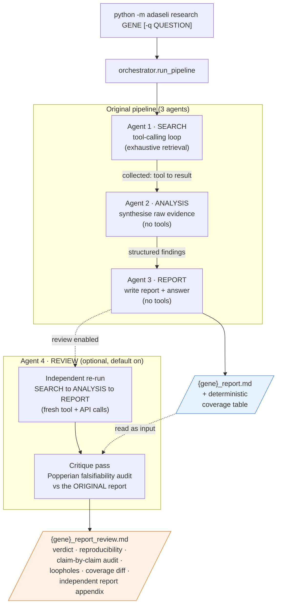
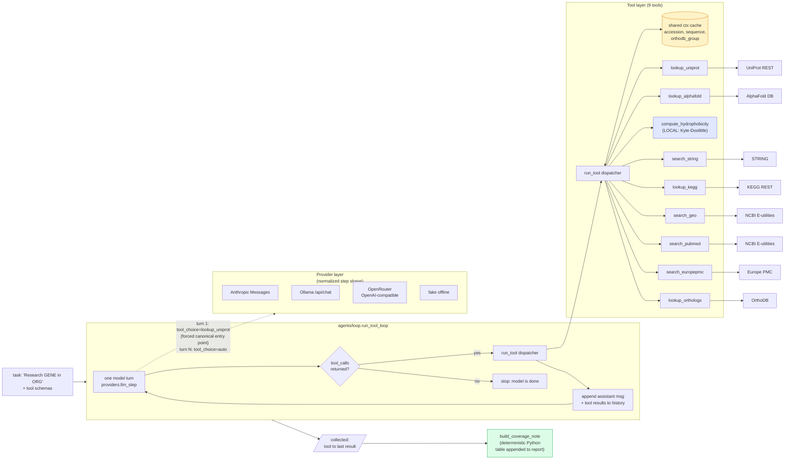
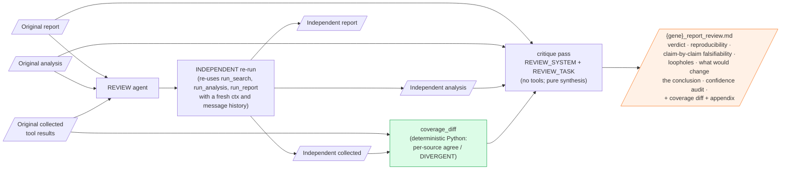
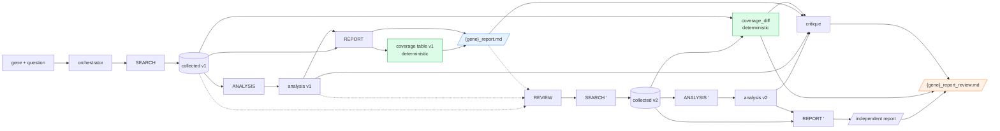

# adaseli — architecture

A four-agent pipeline for exhaustive, falsifiable single-gene research over public
biological databases. The LLM does not run a hardwired script — it **drives** the work
by selecting tools, and the safety-critical parts (the tools themselves, the coverage
tables, the reproducibility diff) are deterministic Python.

---

## 1. High-level flow



The original report is **saved and never modified** before the reviewer runs.

---

## 2. Inside the SEARCH agent — the tool-calling loop

The same loop also powers the reviewer's independent re-run.



Key mechanics:

- **Forced first call.** Turn 1 uses `tool_choice="lookup_uniprot"` so the canonical entry tool always runs (it primes the accession + sequence the others reuse). Subsequent turns are `tool_choice="auto"` so the model can stop when its research is done. Reasoning models don't burn tokens "deciding" the first step.
- **Shared ctx cache.** Tool args like `sequence` and `uniprot_accession` are optional in the schema. The dispatcher fills them from `ctx` (populated by `lookup_uniprot`). A small model never has to copy a 300-aa sequence back through a tool call.
- **Tools never raise.** Every tool returns either real data or `{"error": "..."}`. The agent treats errors as findings (record + move on), not as crashes.

---

## 3. The 4th agent (REVIEW) — independent replication + falsifiability



What the critique looks for (encoded in `REVIEW_SYSTEM`):

- annotation transferred from low-identity orthologs (homology ≠ same function)
- STRING edges sourced from text-mining / co-expression rather than experiment
- expression (GEO) correlation being read as function or causation
- "absence of evidence" reported as "evidence of absence"
- over-interpretation of a single predictor (GRAVY, predicted TM count, AlphaFold pLDDT)
- small-model summarisation errors or unsupported logical leaps in the prose
- divergences between the original and the independent run (flagged as red flags)

For every substantive claim it asks: *what would falsify this? does the evidence actually rule that out? where's the weakest link?* The deterministic coverage diff is the trust anchor — the model cannot fake reproducibility.

---

## 4. Architectural principles (the "method")

| # | Principle | Where it lives |
|---|---|---|
| 1 | **Agents drive, tools are deterministic.** The LLM picks tools; the tools themselves are plain Python that hit public REST APIs (or compute locally). | `tools/registry.py` (dispatcher), `tools/*.py` (one per source) |
| 2 | **Forced canonical entry point.** Turn 1 = `tool_choice="lookup_uniprot"`; reasoning effort isn't wasted choosing the obvious first step. | `agents/loop.py` |
| 3 | **Shared ctx cache.** Derived values (accession, sequence, orthodb group) round-trip through Python, not through the model's tool args. | `tools/registry.py:run_tool` |
| 4 | **Fail-soft tools.** Every tool returns `{...}` or `{"error": "..."}`. Errors are findings, not exceptions. | `http.py`, every `tools/*.py` |
| 5 | **Deterministic coverage tables.** Coverage is computed by Python from the actual `collected` dict — the model cannot claim coverage it didn't get. | `agents/loop.build_coverage_note`, `agents/review.coverage_diff` |
| 6 | **Vendor-agnostic providers.** One normalized step shape (`{text, tool_calls, raw, error?}`) across Anthropic, Ollama (native tools), OpenRouter (OpenAI-compatible). One agent, four backends. | `providers/*.py` |
| 7 | **Independent reviewer with cross-check.** The 4th agent re-runs the whole pipeline fresh, then critiques. Reproducibility is verified by Python diffing collected results, not by the model's word. | `agents/review.py` |
| 8 | **Original report is immutable.** The reviewer writes a separate file; nothing is rewritten in place. | `agents/orchestrator.py` |
| 9 | **Honest about its own limits.** The reviewer states explicitly that its independent run queries the *same* public sources — so it tests reproducibility + reasoning, not source bias. | `config.REVIEW_SYSTEM` |
| 10 | **Pluggable models per role.** `--model` / `--report-model` / `--review-model` let the search/analysis loop run a cheap model while the writer or critic use a stronger one. | `cli.py`, `agents/orchestrator.py` |

---

## 5. Data flow (what gets written where)



---

## 6. File map (where each piece lives)

```
adaseli/
  cli.py                 typer CLI: research / check / models / selftest
  config.py              org defaults, model defaults, the 4 agent prompts
  http.py                one shared, fail-soft HTTP helper (timeouts, JSON, errors)
  feedback.py            rich spinner + stage/section banners + coverage tables
  agents/
    orchestrator.py      run_pipeline: search -> analysis -> report -> (review)
    search.py            Agent 1: drives run_tool_loop with SEARCH_SYSTEM
    analysis.py          Agent 2: run_completion (no tools) with ANALYSIS_SYSTEM
    report.py            Agent 3: run_completion (no tools) with REPORT_SYSTEM
    review.py            Agent 4: independent re-run + coverage_diff + critique
    loop.py              run_tool_loop, run_completion, build_coverage_note, format_evidence
  tools/
    registry.py          tool schemas + dispatcher + shared ctx cache + summariser
    sequence.py          UniProt, AlphaFold, compute_hydrophobicity (local)
    network.py           STRING, KEGG
    expression.py        NCBI GEO
    literature.py        PubMed, Europe PMC
    orthology.py         OrthoDB
  providers/
    anthropic_provider.py    Anthropic Messages API over plain HTTP (no SDK)
    ollama_provider.py       Ollama native /api/chat
    openrouter_provider.py   OpenRouter (OpenAI-compatible /chat/completions)
    fake.py                  offline provider for `selftest` (no network/key)
```
