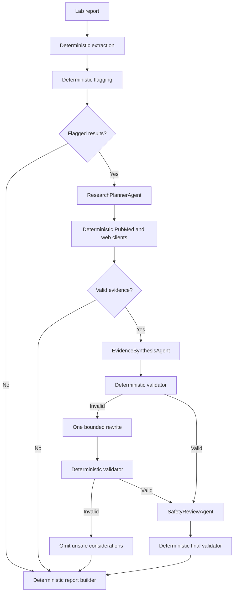

# MEDLENS Multi-Agent Research Runbook

## Goal

Extend MEDLENS from a three-tool demo into a controlled, evidence-backed lab-report research workflow.

The implementation must:

- Preserve deterministic extraction and high/low flagging.
- Research possible condition categories related to flagged results.
- Use PubMed by default and optional domain-restricted web search.
- Cite every medical claim.
- Never diagnose, prescribe, or provide patient-specific instructions.
- Fail closed when evidence or validation is insufficient.
- Remain an educational, synthetic-data-only CLI prototype.

## Architecture decision

Use a bounded multi-agent workflow, not an open-ended agent swarm.

The current workflow is linear and safety-sensitive. Extraction, arithmetic, HTTP search, citation checking, and report writing must remain deterministic Python. LLM agents should only perform three bounded language tasks:

1. `ResearchPlannerAgent`: convert flagged findings and optional user-supplied conditions into safe search queries.
2. `EvidenceSynthesisAgent`: summarize retrieved evidence without exceeding source content.
3. `SafetyReviewAgent`: critique the draft against supplied findings and evidence.

Each agent uses a dedicated skill prompt and a forced structured-output tool call. Agents do not call each other, choose arbitrary tools, fetch arbitrary URLs, or modify shared state.



## Agents, skills, and tools

These are different concepts. Do not merge them.

- **Agent:** one model invocation with a role, bounded input, forced output schema, and no autonomous loop.
- **Skill:** versioned prompt/instructions defining how one agent performs one task.
- **Tool:** deterministic Python capability such as OCR, flagging, PubMed search, validation, or file output.
- **Orchestrator:** normal Python state machine controlling order and failure behavior.

Do not make OCR or numeric flagging into agents. Do not expose unrestricted `fetch_url`, shell, filesystem, or general browser tools to any model.

## Non-negotiable invariants

1. `flag_results()` remains the only authority for high/low/normal.
2. Models never receive patient names, DOB, MRN, addresses, or source filenames in research prompts.
3. Search queries contain only test names, direction (`high`/`low`), broad panel context, and explicitly supplied condition terms.
4. Raw lab values are not sent to web-search providers.
5. A source ID must resolve to a normalized evidence record before it can appear as a citation.
6. Every medical consideration must contain at least one citation.
7. Conditions are framed as possible, non-exhaustive categories—not diagnoses.
8. No treatment, dose, urgency instruction, or direction to change medication.
9. Invalid or unsupported output is omitted from the report; it is never silently saved.
10. The final report clearly separates deterministic findings from AI-generated research notes.
11. Network research defaults to PubMed. General web search is opt-in and domain-restricted.
12. Search failure must not destroy deterministic extraction/flagging output.

## Target package layout

Create or modify these files:

```text
medlens/
  agent.py                 deterministic orchestration state machine
  agents.py                three bounded model role runners
  skills.py                prompts and forced-output schemas
  contracts.py             shared TypedDict/data validation contracts
  research.py              PubMed and optional Tavily clients
  safety.py                redaction, claim/citation, and language validation
  config.py                research configuration and shared disclaimer
  labtools.py              evidence-aware report rendering
  tools.py                 retain extraction/flagging; remove unsafe save path
  providers.py             existing model transport, minimal helper changes only
  cli.py                   research flags and configuration
  fake.py                  scripted outputs for offline end-to-end test
tests/
  test_agent_flow.py
  test_agents.py
  test_research.py
  test_safety.py
  test_report.py
  fixtures/
    pubmed_esearch.json
    pubmed_esummary.json
    pubmed_efetch.xml
    tavily_search.json
docs/
  MULTI_AGENT_RESEARCH_RUNBOOK.md
README.md
requirements.txt
```

Use Python standard library types and `requests`. Do not add an agent framework, vector DB, embeddings, browser automation, or vendor SDK in this implementation.

---

# TODO 1 — Replace free-running loop with explicit orchestration

## Objective

Make workflow order deterministic:

```text
extract -> flag -> plan -> search -> synthesize -> validate -> review -> save
```

The model must no longer decide whether extraction, flagging, validation, or saving happens.

## 1.1 Add shared contracts

Create `medlens/contracts.py`.

Use `TypedDict` for external/state payloads. Add lightweight validation functions because `TypedDict` does not validate at runtime.

Required contracts:

```python
class ResearchQuery(TypedDict):
    query_id: str
    query: str
    rationale: str
    applies_to: list[str]
    source_types: list[str]

class EvidenceItem(TypedDict, total=False):
    source_id: str
    source_type: str
    title: str
    url: str
    excerpt: str
    authors: list[str]
    published_at: str
    pmid: str
    query_id: str
    trusted: bool

class Consideration(TypedDict):
    heading: str
    applies_to: list[str]
    statement: str
    uncertainty: str
    citation_ids: list[str]

class ReviewFinding(TypedDict):
    severity: str
    code: str
    message: str
    consideration_index: int
```

Add:

```python
def validate_research_queries(value, max_queries=4) -> tuple[list[ResearchQuery], list[str]]
def validate_evidence_items(value) -> tuple[list[EvidenceItem], list[str]]
def validate_considerations_shape(value, max_items=6) -> tuple[list[Consideration], list[str]]
```

Validation rules:

- Reject unknown or missing required keys.
- Reject blank strings.
- Enforce unique `query_id` and `source_id`.
- `source_types` may contain only `pubmed` and `web`.
- `uncertainty` may contain only `high`, `moderate`, or `low`; medical output should normally use `high` or `moderate`.
- Limit query length to 300 characters.
- Limit evidence excerpt to 4,000 characters.
- Limit consideration statement to 1,200 characters.
- Return errors; do not raise for model-generated malformed data.

## 1.2 Rewrite `medlens/agent.py`

Keep public function name `run_review()` for CLI compatibility, but replace the current model-driven tool loop.

New signature:

```python
def run_review(
    cfg,
    input_path,
    out_path,
    research_mode="pubmed",
    conditions=None,
    max_sources=8,
    enable_safety_review=True,
):
```

Required state:

```python
ctx = {
    "input_path": input_path,
    "out_path": out_path,
    "rows": [],
    "abnormal": [],
    "queries": [],
    "evidence": [],
    "considerations": [],
    "review_findings": [],
    "limitations": [],
    "saved": None,
}
```

Exact orchestration:

1. Call extraction directly through `run_tool("extract_lab_report", {}, ctx, cfg)`.
2. Stop with `None` if extraction errors or returns zero rows. Do not generate an empty report.
3. Call `run_tool("flag_results", {}, ctx, cfg)` directly.
4. Stop with `None` if flagging errors.
5. If no abnormalities:
   - Skip all research agents and network calls.
   - Set consideration text to the existing unremarkable wording.
   - Build and save report deterministically.
6. If `research_mode == "off"`:
   - Skip research.
   - Add limitation: `Evidence research was disabled.`
   - Save deterministic findings without model-generated medical considerations.
7. Otherwise call `ResearchPlannerAgent`.
8. Validate and sanitize queries before any network request.
9. Execute search clients directly in Python.
10. Deduplicate and rank normalized evidence.
11. If no valid evidence:
    - Add limitation: `No citable evidence was retrieved; condition considerations were omitted.`
    - Save report without considerations.
12. Call `EvidenceSynthesisAgent`.
13. Run deterministic validation from `safety.py`.
14. If invalid, call synthesis once more with validation errors and request a corrected full replacement.
15. If second draft is invalid, discard all considerations and add a limitation.
16. If enabled, call `SafetyReviewAgent`.
17. Treat review findings as advisory input to one final deterministic validation. Do not let reviewer alone approve output.
18. Save only validated considerations and normalized evidence.

No `for step in range(...)` model loop. Remove the current fallback that saves `s.get("text")` as considerations. That fallback is unsafe because arbitrary model text bypasses validation.

## 1.3 Adjust `medlens/tools.py`

Retain:

- `extract_lab_report`
- `flag_results`

Change `save_report`:

- The model must never call it.
- Either remove it from `TOOL_SCHEMAS`, or keep a private deterministic `save_report(ctx, cfg)` function not advertised to models.
- Saving must reject state unless flagging completed.
- Saving receives validated `considerations` and `evidence` from `ctx`, not model arguments.

Keep cached rows in `ctx`. Never allow model-produced rows, values, ranges, or flags to overwrite them.

## 1.4 Completion checks

- No model chooses workflow order.
- No arbitrary assistant text can reach report considerations.
- No research call occurs for a normal panel.
- Existing deterministic flagging output remains unchanged.
- `python -m medlens selftest` still creates a report offline.

---

# TODO 2 — Add deterministic evidence research

## Objective

Provide citable PubMed evidence and optional trusted-domain web results without unrestricted browsing.

## 2.1 Create `medlens/research.py`

Implement one public entry point:

```python
def collect_evidence(
    queries: list[ResearchQuery],
    mode: str,
    max_sources: int,
    cfg: dict,
) -> tuple[list[EvidenceItem], list[str]]:
    """Return normalized evidence and non-fatal limitations."""
```

Supported modes:

- `off`
- `pubmed`
- `web`
- `both`

Reject other modes before making requests.

## 2.2 PubMed client

Use NCBI E-utilities over HTTPS with `requests`; no SDK.

Base:

```text
https://eutils.ncbi.nlm.nih.gov/entrez/eutils/
```

Flow per query:

1. `esearch.fcgi`
   - `db=pubmed`
   - `term=<sanitized query>`
   - `retmode=json`
   - `retmax=<remaining source budget>`
   - `sort=relevance`
   - Include `tool=medlens`.
   - Include configured email if present.
   - Include `api_key` only when configured.
2. `esummary.fcgi`
   - `db=pubmed`
   - `id=<comma-separated PMIDs>`
   - `retmode=json`
3. `efetch.fcgi`
   - `db=pubmed`
   - `id=<comma-separated PMIDs>`
   - `retmode=xml`
   - Parse abstracts with `xml.etree.ElementTree`.

Normalize each paper:

```python
{
    "source_id": f"PMID:{pmid}",
    "source_type": "pubmed",
    "title": title,
    "url": f"https://pubmed.ncbi.nlm.nih.gov/{pmid}/",
    "excerpt": abstract_text,
    "authors": authors,
    "published_at": publication_date,
    "pmid": pmid,
    "query_id": query_id,
    "trusted": True,
}
```

Rules:

- Timeouts: connect/read combined timeout no greater than 30 seconds.
- Retry 429 and transient 5xx up to three attempts with bounded exponential backoff.
- Respect NCBI rate limits: maximum three requests/second without API key, ten/second with API key.
- Send a descriptive `User-Agent` containing project name and configured contact email.
- Missing abstract is allowed, but use summary metadata only and mark limitation.
- Malformed one-paper XML must not discard other papers.
- Never interpolate query text into URLs manually; use `requests` `params=`.

## 2.3 Optional Tavily web search

Implement only when `mode` is `web` or `both`.

Endpoint:

```text
POST https://api.tavily.com/search
```

Configuration:

- `TAVILY_API_KEY` or `MEDLENS_TAVILY_API_KEY`
- If absent, skip web search and add a limitation. Do not fail PubMed results.

Request controls:

```python
{
    "query": query,
    "search_depth": "advanced",
    "max_results": remaining_budget,
    "include_domains": TRUSTED_MEDICAL_DOMAINS,
    "include_answer": False,
    "include_raw_content": False,
}
```

Use this default allowlist:

```python
TRUSTED_MEDICAL_DOMAINS = {
    "nih.gov",
    "ncbi.nlm.nih.gov",
    "medlineplus.gov",
    "cdc.gov",
    "who.int",
    "nice.org.uk",
    "nhs.uk",
}
```

After receiving results:

- Parse hostname with `urllib.parse.urlparse`.
- Accept exact allowlisted domains or their subdomains only.
- Require HTTPS.
- Reject IP-literal hosts, localhost, private hosts, redirects to non-allowlisted domains, and URLs with credentials.
- Do not separately fetch returned URLs in this version.
- Treat Tavily snippets as excerpts, not full source documents.
- `source_id` format: `WEB:<12-char sha256(url)>`.
- Set `trusted=True` only after local domain validation.

Do not add unrestricted URL fetching. This avoids SSRF and arbitrary-content ingestion.

## 2.4 Query privacy and sanitization

Create in `medlens/safety.py`:

```python
def sanitize_search_query(query: str, abnormal_names: list[str], conditions: list[str]) -> str
```

Allowed content:

- Test names present in `ctx["abnormal"]`
- `high`, `low`, `elevated`, `reduced`
- Generic terms such as `differential`, `association`, `review`, `guideline`
- User-supplied condition terms after length and character validation

Forbidden content:

- Source path or filename
- Patient names
- DOB/date-of-birth patterns
- MRN/record numbers
- Addresses, email addresses, phone numbers
- Exact lab numeric values
- Prompt instructions such as `ignore previous instructions`

If sanitization removes meaningful content, reject the query.

## 2.5 Deduplication and ranking

Implement:

```python
def deduplicate_evidence(items: list[EvidenceItem]) -> list[EvidenceItem]
def rank_evidence(items: list[EvidenceItem], max_sources: int) -> list[EvidenceItem]
```

Deduplicate by:

1. PMID.
2. Canonical URL.
3. Normalized title.

Ranking order:

1. PubMed records with abstracts.
2. Trusted guideline/government sources.
3. PubMed records without abstracts.
4. Other accepted web snippets.

Keep stable order within equal rank. Enforce `max_sources` globally, not per query.

## 2.6 Completion checks

- PubMed works without API key at the lower rate.
- General web search never runs unless selected.
- Web result hostnames are locally checked after response.
- Search queries contain no raw numeric values or identifiers.
- Every evidence item has stable `source_id`, title, URL, and source type.
- Partial provider failures produce limitations, not crashes.

---

# TODO 3 — Implement agents and skills

## Objective

Add bounded model roles with strict input/output contracts. A lower-capability model must not need to infer architecture.

## 3.1 Create `medlens/skills.py`

Export:

```python
RESEARCH_PLANNING_SKILL
EVIDENCE_SYNTHESIS_SKILL
SAFETY_REVIEW_SKILL

RESEARCH_PLAN_TOOL
EVIDENCE_DRAFT_TOOL
SAFETY_REVIEW_TOOL
```

Each skill prompt must include:

- Role and exact task.
- Allowed input facts.
- Forbidden behavior.
- Output schema.
- One short valid example.
- Instruction to call only the named output tool.
- Instruction not to include prose outside the tool call.

### Research planning skill requirements

Input:

- Abnormal test names and deterministic directions only.
- Optional user-supplied condition terms.
- Enabled source types.

Output tool: `submit_research_plan`

Schema:

```json
{
  "queries": [
    {
      "query_id": "q1",
      "query": "low haemoglobin low mean cell volume differential review",
      "rationale": "Researches broad categories associated with the flagged pattern.",
      "applies_to": ["Haemoglobin", "Mean Cell Volume"],
      "source_types": ["pubmed"]
    }
  ]
}
```

Rules:

- Maximum four queries.
- Group related findings to avoid one query per row.
- Use broad association/differential wording.
- Do not state that a condition exists.
- Do not include values, ranges, patient identifiers, or source paths.
- If explicit conditions are supplied, research their documented association with the flagged pattern; do not confirm the condition.

### Evidence synthesis skill requirements

Input:

- Deterministic abnormal findings.
- Normalized evidence records with source IDs.
- No full report, no patient identifiers.

Output tool: `submit_evidence_draft`

Schema:

```json
{
  "considerations": [
    {
      "heading": "Possible broad category",
      "applies_to": ["Haemoglobin", "Mean Cell Volume"],
      "statement": "This pattern can be associated with several categories of causes; the supplied evidence discusses ...",
      "uncertainty": "high",
      "citation_ids": ["PMID:12345678"]
    }
  ]
}
```

Rules:

- Use only claims supported by supplied excerpts.
- Cite source IDs exactly.
- Never create URLs, PMIDs, titles, values, or conditions absent from input.
- Distinguish association from causation.
- Avoid prevalence claims unless the excerpt explicitly supports them.
- No diagnosis, treatment, medication advice, dose, urgency, or patient instruction.
- Maximum six considerations.
- Each consideration ends with clinical-correlation wording.
- If evidence is weak or irrelevant, return an empty list.

### Safety review skill requirements

Input:

- Deterministic abnormalities.
- Normalized evidence.
- Draft considerations.

Output tool: `submit_safety_review`

Schema:

```json
{
  "findings": [
    {
      "severity": "error",
      "code": "unsupported_claim",
      "message": "Statement exceeds supplied evidence.",
      "consideration_index": 0
    }
  ]
}
```

Allowed severity: `error`, `warning`.

Reviewer checks:

- Unsupported claim.
- Citation mismatch.
- Diagnostic certainty.
- Treatment or patient instruction.
- Invented finding.
- Missing uncertainty.
- Missing clinical-correlation wording.

Reviewer must not rewrite content and must not add medical facts.

## 3.2 Create `medlens/agents.py`

Implement shared helper:

```python
def call_forced_output(
    cfg: dict,
    system_prompt: str,
    user_payload: dict,
    tool_schema: dict,
    tool_name: str,
) -> tuple[dict | None, list[str]]:
```

Behavior:

1. Serialize `user_payload` with `json.dumps`.
2. Call `providers.chat()` with one system message and one user message.
3. Pass a one-item tool list.
4. Set `tool_choice` to exact `tool_name`.
5. Require exactly one tool call with exact name.
6. Reject assistant prose when no valid tool call exists.
7. Return parsed tool input and errors.
8. Never expose chain-of-thought or place reasoning text in report.

Implement:

```python
def plan_research(cfg, abnormal, conditions, source_types)
def synthesize_evidence(cfg, abnormal, evidence, correction_errors=None)
def review_safety(cfg, abnormal, evidence, considerations)
```

Each function:

- Builds minimum necessary payload.
- Calls `call_forced_output`.
- Runs corresponding shape validator from `contracts.py`.
- Returns `(validated_value, errors)`.
- Makes no network research call and writes no files.

## 3.3 Payload minimization

For all agents:

- Pass `test_name`, `flag`, and unit only when needed.
- Do not pass source file paths.
- Do not pass report demographics or OCR raw text.
- Do not pass normal rows to research agents.
- Pass evidence excerpts only after truncating each to 4,000 characters and total evidence payload to a configured cap.

## 3.4 Model retry rules

- Do not create an autonomous retry loop.
- One correction attempt is allowed only for malformed structured output or failed deterministic draft validation.
- Correction prompt includes validation codes/messages, not hidden reasoning.
- If retry fails, return errors to orchestrator and fail closed.

## 3.5 Completion checks

- All three agents use forced tool output.
- Agent functions cannot mutate report state.
- Agents never directly call search, save, OCR, or flagging functions.
- Invalid model output becomes a typed error, not an exception.
- Same configured model/provider may run all roles; separate model selection is out of scope.

---

# TODO 4 — Enforce safety, citations, CLI controls, and report format

## Objective

Make unsafe or uncited research text impossible to save through normal code paths.

## 4.1 Create `medlens/safety.py`

Implement:

```python
def redact_identifiers(text: str) -> tuple[str, list[str]]
def sanitize_search_query(query, abnormal_names, conditions) -> str
def validate_considerations(
    considerations: list[Consideration],
    abnormal: list[dict],
    evidence: list[EvidenceItem],
) -> tuple[bool, list[ReviewFinding]]
```

Deterministic validation:

- Every `applies_to` name must match an abnormal test name exactly.
- Every `citation_id` must match an evidence `source_id`.
- Every consideration requires at least one citation ID.
- Every consideration requires non-empty uncertainty.
- Every statement must contain uncertainty language such as `possible`, `may`, `can be associated`, or `non-specific`.
- Every statement must contain `clinical correlation` or equivalent approved wording.
- Block diagnostic certainty phrases:
  - `diagnosis is`
  - `confirms`
  - `definitely`
  - `proves`
  - `you have`
  - `patient has`
- Block treatment/instruction phrases:
  - `start`
  - `stop taking`
  - `increase dose`
  - `decrease dose`
  - `take <number>`
  - `must go to`
- Block claims mentioning tests not present in `applies_to` or evidence text when practical.
- Do not claim semantic proof from regex checks. Regex checks are a minimum gate; the safety-review agent is advisory defense in depth.

Return stable machine-readable codes such as:

```text
unknown_abnormality
unknown_citation
missing_citation
missing_uncertainty
missing_clinical_correlation
diagnostic_language
treatment_language
empty_statement
```

## 4.2 Modify `medlens/labtools.py`

Change `build_report()` signature:

```python
def build_report(
    rows,
    abnormal,
    considerations,
    evidence,
    limitations,
    source,
    engine,
    model_label,
    research_mode,
):
```

Report sections:

1. Extracted results.
2. Deterministic flagged abnormalities.
3. Evidence-backed possible considerations.
4. Evidence sources.
5. Limitations and coverage.

Render considerations from structured objects, not raw Markdown supplied by model:

```text
### <escaped heading>
- Applies to: ...
- Uncertainty: HIGH
- <escaped statement> [PMID:12345678]
```

Render evidence:

```text
1. [PMID:12345678] Title. Authors. Date. https://pubmed.ncbi.nlm.nih.gov/12345678/
```

Rules:

- Escape `|`, raw HTML, and control characters.
- Never render model-provided URLs.
- Resolve citation links from normalized evidence only.
- Show research mode and retrieval timestamp.
- Clearly label web snippets as snippets.
- If considerations are omitted, say why using deterministic limitation text.
- Preserve disclaimer at beginning and end.

## 4.3 Modify `medlens/config.py`

Add:

```python
DEFAULT_RESEARCH_MODE = os.environ.get("MEDLENS_RESEARCH_MODE", "pubmed")
DEFAULT_MAX_SOURCES = int(os.environ.get("MEDLENS_MAX_SOURCES", "8"))
NCBI_API_KEY = os.environ.get("NCBI_API_KEY", "")
NCBI_EMAIL = os.environ.get("NCBI_EMAIL", "")
TAVILY_API_KEY = os.environ.get("MEDLENS_TAVILY_API_KEY") or os.environ.get("TAVILY_API_KEY", "")
```

Validate integer bounds at CLI/config boundary:

- `max_sources`: 1–20
- maximum conditions: 5
- each condition: 1–100 characters

Move old all-purpose `AGENT_SYSTEM` into role skills or keep only shared safety principles. Do not use one prompt to control entire workflow.

## 4.4 Modify `medlens/cli.py`

Add `review` options:

```text
--research-mode off|pubmed|web|both
--condition TEXT                 repeatable
--max-sources INTEGER            default 8
--no-safety-review
```

Behavior:

- `--condition` does not assert diagnosis. Help text: `Condition term to research for documented association; does not assert patient diagnosis.`
- Reject `web`/`both` without Tavily key only if strict mode is later added. For this version, continue with PubMed where possible and record limitation.
- Warn before network research that de-identified test names and directions will be sent to configured research providers.
- Do not send OCR text or numeric values.
- Remove or deprecate `--max-steps`; explicit orchestration has no free-running step count.

Pass research config through `_cfg()` or a dedicated nested dictionary:

```python
cfg["research"] = {
    "mode": research_mode,
    "max_sources": max_sources,
    "ncbi_api_key": ...,
    "ncbi_email": ...,
    "tavily_api_key": ...,
}
```

Never print API keys in logs or reports.

## 4.5 Modify `medlens/fake.py`

Replace one linear three-tool script with deterministic fake outputs keyed by forced output tool name:

- `submit_research_plan`
- `submit_evidence_draft`
- `submit_safety_review`

Fake evidence retrieval belongs in tests or a research client injection, not model fake output.

Allow `run_review()` dependency injection:

```python
def run_review(..., evidence_collector=collect_evidence):
```

This enables offline tests without global monkeypatching.

## 4.6 Completion checks

- Uncited consideration cannot be rendered.
- Unknown citation ID cannot be rendered.
- Model-provided URL cannot be rendered.
- Search/provider failure appears under limitations.
- CLI can run with `--research-mode off`.
- Default PubMed mode works without Tavily.
- API keys never appear in logs, reports, errors, or serialized agent payloads.

---

# TODO 5 — Add tests, offline fixtures, docs, and release gate

## Objective

Prove workflow order, privacy, citation integrity, and failure behavior before calling implementation complete.

Use `unittest` and `unittest.mock` to avoid adding a test framework dependency. Tests must not access live networks or real model providers.

## 5.1 `tests/test_agent_flow.py`

Test exact state transitions:

1. Extraction error returns `None`; no later calls.
2. Zero rows returns `None`.
3. Flagging error returns `None`.
4. Normal panel skips planner, network, synthesis, and reviewer.
5. Research off skips all model research roles.
6. Abnormal panel follows planner → search → synthesis → validation → review → save.
7. Empty evidence omits considerations and saves deterministic findings.
8. Invalid first synthesis triggers exactly one correction.
9. Invalid second synthesis is discarded.
10. Safety reviewer failure does not bypass deterministic validator.
11. Output file is written only at final save.

Use call-recording fakes and assert exact call order.

## 5.2 `tests/test_research.py`

Using fixtures and mocked `requests`:

- PubMed search IDs parse correctly.
- Summary and XML abstracts merge by PMID.
- Missing abstract produces valid evidence plus limitation.
- 429/5xx retries are bounded.
- 4xx auth/config errors are not endlessly retried.
- Duplicate PMID, URL, and title collapse correctly.
- Global `max_sources` is enforced.
- Tavily results outside allowlist are rejected.
- `https://evil.example/?next=nih.gov` is rejected.
- `https://nih.gov.evil.example/` is rejected.
- Valid subdomains such as `www.cdc.gov` are accepted.
- Missing Tavily key degrades cleanly.
- No HTTP request contains raw lab values or source path.

## 5.3 `tests/test_agents.py`

Mock `providers.chat()`:

- Exact forced tool name is passed.
- One valid output parses.
- Wrong tool name is rejected.
- Multiple tool calls are rejected.
- Prose-only output is rejected.
- Missing required fields are rejected.
- More than four research queries are rejected.
- Invented `applies_to` entries fail later deterministic validation.
- Correction errors are passed without hidden chain-of-thought.

## 5.4 `tests/test_safety.py`

Test:

- Unknown citation.
- Missing citation.
- Unknown abnormal test name.
- Diagnostic certainty phrase.
- Treatment/dose phrase.
- Missing uncertainty wording.
- Missing clinical-correlation wording.
- Empty statement.
- Valid bounded statement.
- Identifier redaction for email, phone, DOB, MRN-like tokens, and source paths.
- Query sanitizer removes exact values and rejects prompt injection text.

## 5.5 `tests/test_report.py`

Test:

- Disclaimer appears first and last.
- Deterministic values/flags are unchanged.
- Structured considerations render with citations.
- Evidence bibliography resolves URLs from normalized evidence.
- Model-supplied raw HTML is escaped.
- Pipe characters do not break tables.
- No evidence means explicit omission wording.
- Web snippets are labeled.
- Research mode and limitations are displayed.

## 5.6 Offline end-to-end test

Update `python -m medlens selftest`:

- Use synthetic transcript.
- Use fake planner/synthesizer/reviewer.
- Inject fixture-backed evidence collector.
- Make no network calls.
- Produce report with at least one valid PMID citation.
- Exit non-zero if output is missing disclaimer, deterministic flags, citation, or limitations section.

## 5.7 Documentation

Update `README.md`:

- Replace claim that model chooses every tool with bounded orchestrator design.
- Explain agents vs skills vs deterministic tools.
- Document data sent to model and research providers.
- Document PubMed default and Tavily opt-in.
- Add env vars and CLI examples.
- State synthetic-only constraint.
- State evidence retrieval and citations do not make output clinically validated.

Add examples:

```bash
# PubMed-backed research
python -m medlens review --research-mode pubmed

# Research explicit condition association without asserting diagnosis
python -m medlens review --research-mode pubmed --condition "iron deficiency"

# PubMed plus trusted-domain web search
export TAVILY_API_KEY=...
python -m medlens review --research-mode both

# Deterministic report only
python -m medlens review --research-mode off
```

Do not commit generated reports containing keys, full provider payloads, or non-synthetic data.

## 5.8 Required verification commands

Run from repository root:

```bash
python -m unittest discover -s tests -v
python -m medlens selftest --quiet
python -m medlens review --research-mode off --no-pick --quiet
```

Optional live smoke test, only when keys and network access are intentionally available:

```bash
python -m medlens review \
  --research-mode pubmed \
  --condition "iron deficiency" \
  --max-sources 4 \
  --no-pick \
  -v
```

Inspect generated report manually. Confirm:

- No identifiers or exact values appear in outbound research logs.
- All considerations have clickable citations.
- Citation IDs match bibliography entries.
- Language remains uncertain and non-diagnostic.
- Deterministic table values match source transcript.

---

# Implementation order for a lower-capability coding model

Complete one TODO at a time. Do not modify unrelated code.

For each TODO:

1. Read every referenced existing file before editing.
2. Implement only that TODO.
3. Add/update its tests immediately.
4. Run all tests.
5. Fix regressions before starting next TODO.
6. Report changed files, test result, and any deviation from this runbook.

Recommended prompt sequence:

```text
Implement TODO 1 from docs/MULTI_AGENT_RESEARCH_RUNBOOK.md.
Follow contracts and orchestration order exactly.
Do not start TODO 2.
Add tests specified for TODO 1 and run the full test suite.
```

Repeat for TODOs 2–5.

## Stop conditions

The coding model must stop and ask rather than guess if:

- Existing tests contradict this runbook.
- Provider behavior cannot force a named tool.
- PubMed/Tavily response shape differs from stored fixtures.
- A requested change would send raw OCR text, values, or identifiers to search.
- A report path could write outside the user-selected output location.
- A safety validator would need clinical knowledge rather than structural/policy checks.

## Definition of done

All five TODOs are complete only when:

- Workflow is explicit and deterministic.
- Three bounded agents and three skill prompts exist.
- PubMed research works; Tavily remains optional and allowlisted.
- Every rendered medical claim has a validated citation.
- Invalid drafts fail closed.
- No patient identifiers or raw values are sent to search.
- Offline test suite passes with zero network access.
- README accurately documents architecture, privacy, limits, and CLI.

